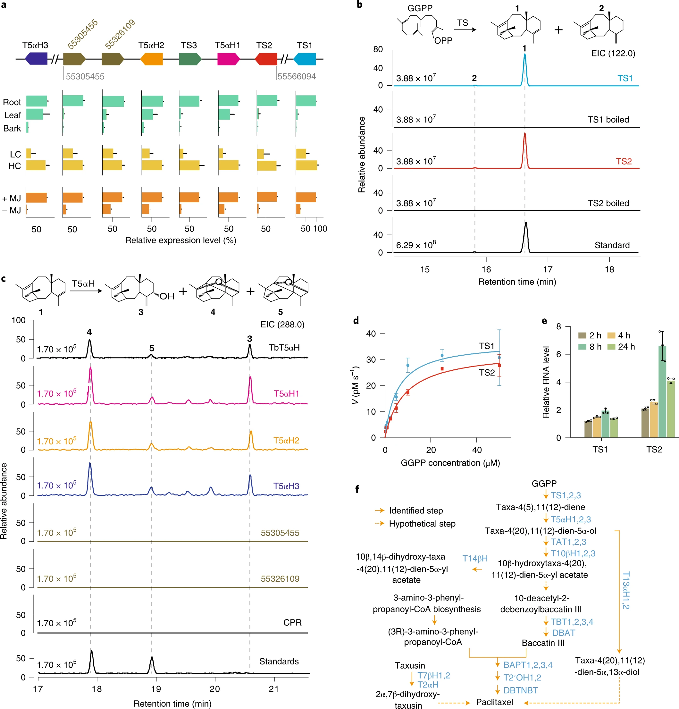

## WGCNA and Meta-analyses

Tutorials for the WGCNA package

https://horvath.genetics.ucla.edu/html/CoexpressionNetwork/Rpackages/WGCNA/Tutorials/

https://mp.weixin.qq.com/s/4N8eAStl0D7hL04G-4yICg

Meta-analyses of data from two (or more) microarray data sets

https://horvath.genetics.ucla.edu/html/CoexpressionNetwork/JMiller/

[Meta-analysis identifies pleiotropic loci controlling phenotypic trade-offs in sorghum.pdf](./document/iyab087.pdf)

## 植物天然产物合成生物学研究
植物能合成微量次生代谢物，进而发挥机体生物防御和信号传导作用。由于这些植物天然产物对人体有较强的生理活性，已被广泛应用于医药健康等领域。据中国社会科学院医药蓝皮书《中国药品市场报告（2012）》称，中国药品市场2012年总规模为9 261亿元人民币；预计到2020年，中国药品市场的规模将达到2.3万亿元人民币[1]。植物天然产物一直作为药物、保健品及化妆品的重要来源，如吗啡、青蒿素、麻黄素和紫杉醇等药效显著的药物均属于植物源药物；年销售额超过400亿美元的激素类药物，目前主要是以薯蓣皂素、番麻皂素和剑麻皂素等植物皂素为基础原料生产[2, 3]。另外，植物天然产物在农药、兽药及其他与人类生活密切相关的工农业生产领域中也具有广泛的需求和应用，如黄连中的黄连素等生物碱类抗生素在畜牧养殖中的应用有良好安全性，已经成为理想的饲用抗生素替代品。与此同时，高品质的植物天然产物，如人参皂苷、玫瑰精油、番茄红素、花青素、新型甜味剂罗汉果苷和甜菊糖等，是人类化妆品、保健品和调味剂的主要原料，市场前景广阔[3]。

植物提取是目前植物天然产物的主要生产方式。这种传统生产模式有较多缺点，如天然产物含量低且差异大，植物生长周期长，类似物复杂导致产品纯化难，以及对生物资源尤其是野生植物资源造成严重破坏等[3-5]。随着市场需求的日益增大，野生名贵中药灵芝、人参、三七的原植物均已濒危或野外灭绝，目前的资源供给已经难以为继[3]。在化学合成方面，由于大部分天然产物结构复杂，具有较多的手性中心，合成过程中容易形成无活性甚至有毒的、难以分离的旋光异构体；而且合成过程步骤繁琐，转化率低，能耗高，所用有机溶剂易造成污染，难以满足工业化需求[3]。而植物组织细胞培养法操作较复杂、周期长，且由于生产成本过高，所以也不易实现工业化。相比较而言，利用酿酒酵母酿造啤酒的类似原理，通过发酵生产植物天然产物具有生产周期短、不受时节和原料供应的限制、发酵产物比较单一、易于分离纯化等优点，容易实现大规模工业化生产。

基于合成生物学的原理，设计和创建人工合成细胞发酵生产植物天然产物，既能有效控制原料供给，又能保护自然资源及环境，其作为一种绿色高效的新型生产模式已被科学界及工业界认可[3]。近年来，随着合成生物学的飞速发展，微生物合成植物源天然产物的种类不断增多，产量也在逐年攀升[6-8]。本文将从研究路线出发，在萜类、苯丙素类和生物碱等化合物的生产应用案例中介绍人工合成细胞生产植物源天然产物的研究现状。

戴住波, 王勇, 周志华, 李盛英, 张学礼. 植物天然产物合成生物学研究. 中国科学院院刊, 2018, 33(11): 1228-1238

## 天然产物在线免费数据库大集合

天然产物是指动物、植物提取物或昆虫、海洋生物和微生物体内的组成成分或其代谢产物以及人和动物体内许许多多内源性的化学成分统称，其与药物发现，化学生态学和分子生物学等领域紧密相关，一直以来备受科学界的关注。多年来，各种主题的天然产物数据库不断增加。2020年，德国耶拿大学(University of Jena)Steinbeck课题组发表了综述"Review on natural products databases: where to find data in 2020",清点了过去20年发布的120多种天然产物数据库。其中，16％已不再在线，40％是商业的，剩下是开放的NP数据库，通常专门针对特定类型。
https://jcheminf.biomedcentral.com/articles/10.1186/s13321-020-00424-9

## 紫杉醇生物合成

https://www.nature.com/articles/s41477-021-00963-5

## 转录因子结合位点
转录因子结合位点（TFBS）是顺式调控元件的基本组成部分，在基因表达的精确调控中起重要作用。TFBS核心基序内的非编码变异可能会显著改变其结合亲和力，这可能是解释遗传变异如何影响复杂性状的生物学机制。植物中转录因子结合位点实验数据的缺乏，以及植物TFs的独立进化特性都使得鉴定植物TFBS的计算方法落后于相关的人类研究。本研究首先使用深度卷积神经网络(DeepCNN)在基于可用的拟南芥Dap-seq数据集建立了265个拟南芥TFBS的预测模型，并且将其迁移用于预测其他植物的同源TF,为了提供更方便、更优质的生物信息学服务，课题组为此具有高精确率辨别转录因子结合位点的深度卷积神经网络模型搭建了docker镜像，通过下载该镜像并在本地配置可以实现离线预测植物转录因子结合位点的预测功能
下载网址：
https://github.com/liulifenyf/TSPTFBS
原文链接：
https://academic.oup.com/bioinformatics/article/37/2/260/6069568
